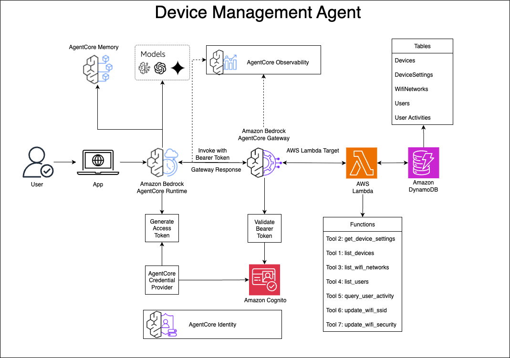

# Device Management System

## Overview

This use case implements a comprehensive Device Management System using Amazon Bedrock AgentCore. It provides a unified interface for managing IoT devices, WiFi networks, users, and activities through AWS Lambda, allowing users to interact with their smart home devices through natural language.

| Information | Details |
|-------------|---------|
| Use case type | Conversational |
| Agent type | Single agent |
| Use case components | Tools, Gateway |
| Use case vertical | IoT/Smart Home |
| Example complexity | Intermediate |
| SDK used | Amazon Bedrock AgentCore SDK, boto3 |

## Use case Architecture



### Process Flow

1. **User Interaction**: Users interact with the Device Management system through Amazon Q or other clients that support the MCP protocol.

2. **Request Processing**:
   - The request is sent to Amazon Bedrock AgentCore
   - AgentCore routes the request to the appropriate Gateway
   - The Gateway forwards the request to the Gateway Target (Lambda function)

3. **Tool Execution**:
   - The Lambda function receives the request and identifies the appropriate tool to execute
   - The function interacts with DynamoDB tables to perform CRUD operations
   - Results are processed and formatted according to the MCP protocol

4. **Response Flow**:
   - The Lambda function returns the response to the Gateway
   - The Gateway forwards the response back to AgentCore
   - AgentCore delivers the response to the client

5. **Data Flow**: All device data, user information, and configuration settings are stored in and retrieved from DynamoDB tables.

6. **Observability Flow**:
   - The AgentCore runtime sends logs to CloudWatch Logs
   - Gateway operations are logged to dedicated CloudWatch log groups
   - Traces are captured by AWS X-Ray
   - Custom metrics are published to CloudWatch Metrics
   - All observability data can be monitored through the AWS Console

## Use case key Features

The Device Management System provides the following capabilities:

- List devices in the system
- Get device settings
- List WiFi networks for a device
- Update WiFi network settings (SSID, security type)
- List users within an account
- Query user activity within a time period

## Prerequisites

- Python 3.10+
- AWS account with appropriate permissions
- boto3 and Amazon Bedrock AgentCore SDK
- Cognito User Pool with configured app client (for Gateway/Runtime authentication)
- Cognito User Pool with configured app client (for Frontend authentication - separate from Gateway)
- Cognito Domain (optional but recommended for hosted UI)
- IAM Role for Bedrock Agent Core Gateway with appropriate permissions

Attach the below policy to your IAM role:
```json
{
    "Version": "2012-10-17",
    "Statement": [
        {
            "Sid": "VisualEditor0",
            "Effect": "Allow",
            "Action": [
                "iam:PassRole",
                "bedrock-agentcore:*"
            ],
            "Resource": "*"
        }
    ]
}
```

## Use case setup

### 1. Environment Configuration

Create a `.env` file in the project root with the following variables:

```
# AWS and endpoint configuration
AWS_REGION=us-west-2
ENDPOINT_URL=https://bedrock-agentcore-control.us-west-2.amazonaws.com

# Lambda configuration
LAMBDA_FUNCTION_NAME=DeviceManagementLambda
LAMBDA_ARN=arn:aws:lambda:us-west-2:your-account-id:function:DeviceManagementLambda

# Gateway configuration
GATEWAY_IDENTIFIER=your-gateway-identifier
GATEWAY_NAME=Device-Management-Gateway
GATEWAY_DESCRIPTION=Device Management Gateway
ROLE_ARN=arn:aws:iam::your-account-id:role/YourGatewayRole

# Gateway observability (auto-populated by deploy script)
GATEWAY_ARN=arn:aws:bedrock-agentcore:us-west-2:your-account-id:gateway/your-gateway-id
GATEWAY_ID=your-gateway-id

# Target configuration
TARGET_NAME=device-management-target
TARGET_DESCRIPTION=List, Update device management activities

# Cognito configuration for Gateway/Runtime
COGNITO_USERPOOL_ID=your-gateway-cognito-userpool-id
COGNITO_APP_CLIENT_ID=your-gateway-cognito-app-client-id
COGNITO_DOMAIN=your-gateway-cognito-domain.auth.us-west-2.amazoncognito.com
COGNITO_CLIENT_SECRET=your-gateway-cognito-client-secret

# Cognito configuration for Frontend (separate user pool)
FRONTEND_COGNITO_USERPOOL_ID=your-frontend-cognito-userpool-id
FRONTEND_COGNITO_APP_CLIENT_ID=your-frontend-cognito-app-client-id
FRONTEND_COGNITO_DOMAIN=your-frontend-cognito-domain.auth.us-west-2.amazoncognito.com
FRONTEND_COGNITO_CLIENT_SECRET=your-frontend-cognito-client-secret

# Frontend configuration (auto-populated by deploy script)
MCP_SERVER_URL=https://your-gateway-id.gateway.bedrock-agentcore.us-west-2.amazonaws.com
```

**Note**: You can use the provided `.env.example` file as a template by copying it to `.env` and updating the placeholder values.

### 2. Install Dependencies

Install the required Python packages:

```bash
pip install -r requirements.txt
```

### 3. Automated Deployment

You can deploy all components using the provided deployment script:

```bash
chmod +x deploy_all.sh
./deploy_all.sh
```

The deployment script performs the following actions:
- Deploys the Lambda function with dependencies
- Creates and configures the gateway
- Sets up gateway targets
- Enables gateway observability (CloudWatch logging)
- Configures the agent runtime
- Sets up frontend configuration

### 4. Manual Deployment (Alternative)

If you prefer to deploy components individually:

#### Deploy Lambda Function
```bash
cd device-management
chmod +x deploy.sh
./deploy.sh
cd ..
```

#### Create Gateway
```bash
cd gateway
python create_gateway.py
```

#### Create Gateway Target
```bash
python device-management-target.py
```

#### Setup Gateway Observability
```bash
python gateway_observability.py
cd ..
```

#### Setup Agent Runtime
```bash
cd agent-runtime
chmod +x setup.sh
./setup.sh
cd ..
```

#### Setup Frontend (Optional)
```bash
cd frontend
chmod +x setup_and_run.sh
./setup_and_run.sh
cd ..
```

### 5. Generate Test Data (Optional)

To populate the tables with synthetic test data:

```bash
cd device-management
python synthetic_data.py
cd ..
```

## Execution instructions

### 1. Test the Lambda Function

You can test the Lambda function locally using the provided test script:

```bash
python test_lambda.py
```

### 2. Invoking tools using Q CLI

#### Generating the Bearer Token

To generate the Bearer token required for authentication, use the following curl command to request an access token from the Cognito OAuth2 endpoint:

```bash
curl --http1.1 -X POST https://<cognito domain>.auth.us-west-2.amazoncognito.com/oauth2/token \
-H "Content-Type: application/x-www-form-urlencoded" \
-d "grant_type=client_credentials&client_id=<client id>&client_secret=<client_secret>"
```

This command will return a JSON response containing the access token that should be used as the Bearer token in the MCP configuration.

#### Configuring MCP

Update the mcp.json file with this config:
```json
cd ~/.aws/amazonq
vi mcp.json
## Update this json
{
  "mcpServers": {
    "<you_desired_mcp_server_name>": {
      "command": "npx",
      "timeout": 60000,
      "args": [
        "mcp-remote@latest",
        "https://<gateway id>.gateway.bedrock-agentcore.<REGION>.amazonaws.com/mcp",
        "--header",
        "Authorization: Bearer <Bearer token>"
      ]
    }
  }
}
```

Replace `<Bearer token>` with the access token obtained from the Cognito authentication request.

### 3. Using the Web Frontend

After setting up the frontend, you can interact with the Device Management system through the web interface:

1. **Access the application**:
   ```bash
   # If using Docker
   open http://localhost:5001
   
   # If running locally
   open http://localhost:5001
   ```

2. **Authentication**:
   - Use AWS Cognito login (if configured)
   - Or use the simple login form with your credentials

3. **Chat Interface**:
   - Type your device management queries in the chat interface
   - Responses will stream in real-time from the agent

### 4. Sample prompts:

1. "Can you list all the dormant devices?"
2. "Can you update SSID for my device ID DG-10016 to XXXXXXXXXX'?"
3. "Can you list all the available tools?"
4. "Can you show me the device settings for the device ID DG-10016?"
5. "Can you show me the Wifi setting for the device ID DB-10005?"

## Clean up instructions

To clean up resources created by this use case:

1. Delete the Lambda function:
```bash
aws lambda delete-function --function-name DeviceManagementLambda
```

2. Delete the Gateway Target:
```bash
aws bedrock-agentcore delete-gateway-target --gateway-identifier <your-gateway-identifier> --target-name device-management-target
```

3. Delete the Gateway (if you created a new one):
```bash
aws bedrock-agentcore delete-gateway --gateway-identifier <your-gateway-identifier>
```

4. Delete the DynamoDB tables (if you created them for this use case):
```bash
aws dynamodb delete-table --table-name Devices
aws dynamodb delete-table --table-name DeviceSettings
aws dynamodb delete-table --table-name WifiNetworks
aws dynamodb delete-table --table-name Users
aws dynamodb delete-table --table-name UserActivities
```

## Disclaimer

The examples provided in this repository are for experimental and educational purposes only. They demonstrate concepts and techniques but are not intended for direct use in production environments. Make sure to have Amazon Bedrock Guardrails in place to protect against prompt injection.

## Additional Information

### Files

- `lambda_function.py`: Main Lambda handler that implements all MCP tools
- `dynamodb_models.py`: DynamoDB table definitions and initialization
- `synthetic_data.py`: Script to generate synthetic test data
- `requirements.txt`: Python dependencies
- `deploy.sh`: Deployment script for the Lambda function
- `create_gateway.py`: Script to create a gateway for the MCP server
- `device-management-target.py`: Script to create a gateway target for the Lambda function
- `.env`: Environment variables configuration file
- `test_lambda.py`: Script to test the Lambda function locally

### Folders

- `device-management/`: Contains the Lambda function and DynamoDB setup
- `gateway/`: Contains gateway creation and configuration scripts
- `agent-runtime/`: Contains agent runtime components for handling communication between frontend and backend services
- `frontend/`: Contains the web frontend application for device management
- `images/`: Contains architecture diagrams and documentation images

### IAM Permissions

The Lambda function requires the following IAM permissions:

```json
{
  "Version": "2012-10-17",
  "Statement": [
    {
      "Effect": "Allow",
      "Action": [
        "dynamodb:GetItem",
        "dynamodb:Query",
        "dynamodb:Scan",
        "dynamodb:UpdateItem"
      ],
      "Resource": [
        "arn:aws:dynamodb:<Region>:*:table/Devices",
        "arn:aws:dynamodb:<Region>:*:table/DeviceSettings",
        "arn:aws:dynamodb:<Region>:*:table/WifiNetworks",
        "arn:aws:dynamodb:<Region>:*:table/Users",
        "arn:aws:dynamodb:<Region>:*:table/UserActivities",
        "arn:aws:dynamodb:<Region>:*:table/UserActivities/index/ActivityTypeIndex"
      ]
    }
  ]
}
```

### Troubleshooting

- **Missing environment variables**: Ensure all required variables are set in the `.env` file
- **Lambda deployment failures**: Check AWS IAM permissions and Lambda service quotas
- **Gateway creation failures**: Verify the Cognito User Pool ID, App Client ID, and IAM role ARN
- **Gateway target creation failures**: Verify the gateway identifier and Lambda ARN are correct
- **DynamoDB access issues**: Confirm the Lambda execution role has the necessary permissions
