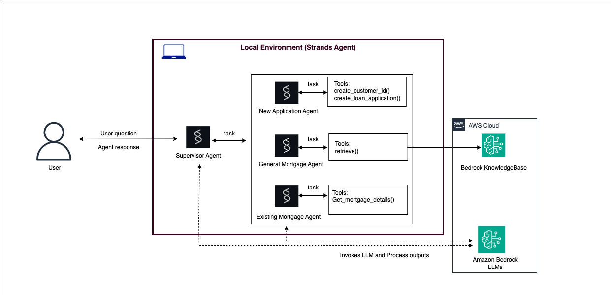

# Mortgage assistant - Local Development with Strands Agents SDK

## What you will learn

* Develop a prototype of the mortgage assistant - a multi-agent with Agents-as-tools pattern using Strands SDK
* Run it in your local environment. You will provide a prompt **"What are the benefits of a 15-year mortgage?"** and see how the agent retrived this information from the KnowledgeBase you configured in the Prequisite section.


## Architecture diagram

The prototype has a supervisor agent which co-ordinates the task with the 3 sub-agents: new application agent, general mortgage agent and the existing mortgage agent.



# Steps to run

Run the below commands and examine the output

```
uv run mortgage_agent.py --prompt "What are the benefits of a 15-year mortgage?"
```
