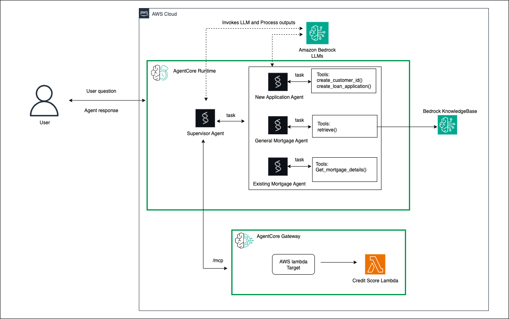

# Mortgage assistant - AgentCore Gateway integration

## What you will learn

Amazon Bedrock AgentCore Gateway provides an easy and secure way for developers to build, deploy, discover, and connect to tools at scale. AI agents need tools to perform real-world tasks—from querying databases to sending messages to analyzing documents. With Gateway, developers can convert APIs, Lambda functions, and existing services into Model Context Protocol (MCP)-compatible tools and make them available to agents through Gateway endpoints with just a few lines of code. 

## Architecture diagram

You will be hosting the **Credit check MCP Server** . The **supervisor agent** running in the AgentCore Runtime will access the tools exposed through the Lambda function configued as target. 

# Steps to run

1. Run mortgage_gateway.ipynb notebook. By the end of running the notebook, below will be achieved:

    a. Lambda (creditcheck_lambda) will be created and code deployed

    b. Creates Gateway (MortgageAgentforLambda) and a Target to lambda created in previous step

    c. Generate Oauth inbound token and invoke MCP exposed through Gateway URL from Strands MCP client

    d. In the above step we have created agentcore gateway and invoked it through MCP client. Let's integrate MCP into Mortgage Agent multi agent workflow created as part of 
       agentcore runtime (03-agentcore-runtime). The last section creates agentcore runtime with agentcore gateway MCP added. Checks the status of the runtime and also invokes the runtime

