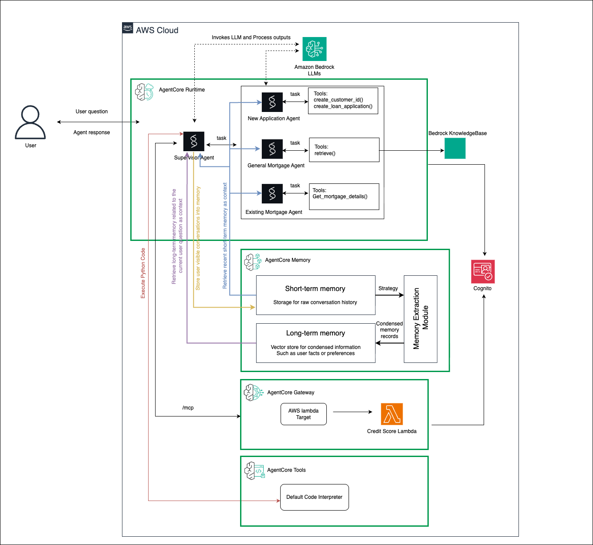

# Mortgage Assistant - AgentCore Tools Integration

## What you will learn

* Extend the Strands mortgage agent built from previous sections with Amazon Bedrock AgentCore built-in tools
* Use AgentCore Code Interpreter for dynamic mortgage calculations
* Execute Python code in secure sandbox environments
* Enhance existing agents with advanced computational capabilities

## Overview

Amazon Bedrock AgentCore provides two built-in tools to enhance your agents:
- **Code Interpreter**: Secure environment for executing Python, TypeScript, and JavaScript code
- **Browser Tool**: Secure, cloud-based browser for web interactions and data extraction

This example demonstrates how to extend the Strands mortgage assistant built from previous sections with AgentCore's built-in `Code Interpreter` tool. The enhanced agent can perform complex mortgage calculations, specifically comparing fortnightly vs monthly payment strategies with dynamic Python code execution.


## Architecture

The enhanced mortgage assistant integrates AgentCore's Code Interpreter to provide dynamic mortgage analysis capabilities. When customers ask about payment comparisons, the agent generates and executes Python code in a secure sandbox environment.

<div style="text-align:left">
    
</div>

## How AgentCore Tools are Integrated with Strands Agents

Adding AgentCore's built-in tools to the mortgage agent built from previous sections requires **just 3 key additions**:

### 1. **Import AgentCore Tools**
```python
# Import the specific tool client you need
from bedrock_agentcore.tools.code_interpreter_client import code_session
```

### 2. **Create Tool Wrapper Functions**

The implementation uses two complementary tools for dynamic mortgage calculations:

#### Requirements Generator Tool
```python
@tool
def compare_fortnightly_vs_monthly_payments(loan_amount: float, interest_rate: float, 
                                          loan_term_years: int = 30) -> str:
    """
    Get requirements for fortnightly vs monthly payment analysis. This will prompt you to 
    generate Python code for the specific loan parameters.
    """
    requirements = f"""
## Task
Generate executable Python code to analyze and compare fortnightly versus monthly mortgage payment strategies.

## Input Parameters
- Principal: ${loan_amount:,.2f}
- Interest rate: {interest_rate}%
- Loan term: {loan_term_years} years

## Technical Requirements
Your code must:
1. Use standard Python libraries only (no external dependencies)
2. Implement the standard mortgage formula: M = P * [r(1+r)^n] / [(1+r)^n - 1]
3. Calculate both monthly and fortnightly payment scenarios
4. Provide detailed payment method comparisons
5. Provide detailed savings analysis
    """
    return requirements
```

#### Code Execution Tool
```python
@tool
def execute_python_code(code: str, description: str = "Python code execution") -> str:
    """Execute Python code in secure sandbox environment for mortgage calculations."""
    try:
        with code_session(region) as code_client:
            response = code_client.invoke("executeCode", {
                "code": code,
                "language": "python",
                "clearContext": False
            })
        
        for event in response["stream"]:
            return json.dumps(event["result"])
            
    except Exception as e:
        return json.dumps({
            "isError": True,
            "content": [{"type": "text", "text": f"Error executing code: {str(e)}"}]
        })
```

### 3. **Add Tools to Agent**
```python
# Add your new tools to the agent's tool list
all_tools = [
    # ... existing tools ...
    compare_fortnightly_vs_monthly_payments,  # Requirements generator
    execute_python_code,                      # Code execution in sandbox
]
```

## Code Interpreter Integration Workflow

The mortgage assistant uses a **two-step process** for dynamic mortgage calculations:

### Step 1: Requirements Generation
When a customer asks about fortnightly vs monthly payment comparisons, the agent:
1. Calls `compare_fortnightly_vs_monthly_payments()` with the customer's loan parameters
2. Receives detailed requirements specifying what calculations and outputs are needed
3. The requirements include the mortgage formula, technical specifications, and formatting instructions

### Step 2: Code Generation & Execution
The supervisor agent then:
1. **Generates Python code** based on the requirements and customer's specific loan details
2. Creates complete, executable code that implements mortgage calculations
3. Calls `execute_python_code()` to run the generated code in AgentCore's secure sandbox
4. Returns the calculation results and savings analysis to the customer

### Example Usage
* Run the [agentcore_tools.ipynb](./agentcore_tools.ipynb) notebook which demonstrates the enhanced agent with Code Interpreter capabilities.

This two-step approach ensures that calculations are always tailored to the specific customer scenario while maintaining security through sandboxed execution. The supervisor agent acts as the code generator, interpreting requirements and creating appropriate Python code dynamically.

## Mortgage Calculation Capabilities

The code interpreter implementation provides comprehensive mortgage analysis:

### **Calculation Features**
- **Standard Mortgage Formula**: Implements M = P * [r(1+r)^n] / [(1+r)^n - 1]
- **Payment Frequency Comparison**: Monthly (12 payments/year) vs Fortnightly (26 payments/year)
- **Amortization Analysis**: Exact payoff time calculation for different payment frequencies
- **Interest Savings**: Total interest comparison between payment methods


### **Technical Implementation**
- **Sandbox Security**: All code execution happens in isolated AgentCore environment
- **No External Dependencies**: Uses only standard Python libraries
- **Dynamic Code Generation**: Python code is generated based on specific customer parameters
- **Error Handling**: Comprehensive error handling for code execution failures
- **Formatted Output**: Currency values with proper formatting and clear recommendations

### **Key Benefits**
- **Secure Execution**: Code runs in isolated sandbox environment
- **Dynamic Calculations**: Generate code based on specific customer scenarios  
- **No Dependencies**: Uses standard Python libraries only
- **Real-time Results**: Immediate calculation results
- **Error Handling**: Robust error handling for code execution failures
- **Intelligent Routing**: Supervisor agent automatically determines when to use code interpreter tools

## Supervisor Agent Integration

The supervisor agent coordinates all mortgage assistant capabilities and intelligently routes requests:

```python
def create_supervisor_agent():
    supervisor_system_prompt = """
    # Mortgage Assistant Supervisor
    
    ## Payment Comparison Tools (For fortnightly vs monthly payment comparisons ONLY)
    - When a customer specifically asks about comparing fortnightly vs monthly payments, follow this exact sequence:
      a. Use **compare_fortnightly_vs_monthly_payments** to gather detailed requirements
      b. Generate appropriate Python code based on those requirements
      c. Use **execute_python_code** to run the generated code in the secure sandbox
    - Only use for: "Fortnightly vs monthly payments", "Payment frequency comparison", "Interest savings from fortnightly payments"
    """
    
    all_tools = [
        answer_general_mortgage_questions, 
        answer_existing_mortgage_questions,
        answer_new_loan_application_questions,
        compare_fortnightly_vs_monthly_payments,  # Step 1: Requirements
        execute_python_code,                      # Step 2: Execution
        calculator
    ]
    
    supervisor = Agent(
        model=modelID,
        system_prompt=supervisor_system_prompt,
        tools=all_tools
    )
    
    return supervisor
```


## Related AWS Documentation

- [Execute code and analyze data using Amazon Bedrock AgentCore Code Interpreter](https://docs.aws.amazon.com/bedrock-agentcore/latest/devguide/code-interpreter-tool.html) - Learn how to use the code interpreter built-in tool
- [Use Amazon Bedrock AgentCore built-in tools](https://docs.aws.amazon.com/bedrock-agentcore/latest/devguide/built-in-tools.html) - Overview of all built-in tools available
- [Creating an AgentCore Code Interpreter](https://docs.aws.amazon.com/bedrock-agentcore/latest/devguide/code-interpreter-create.html) - How to create code interpreter instances

