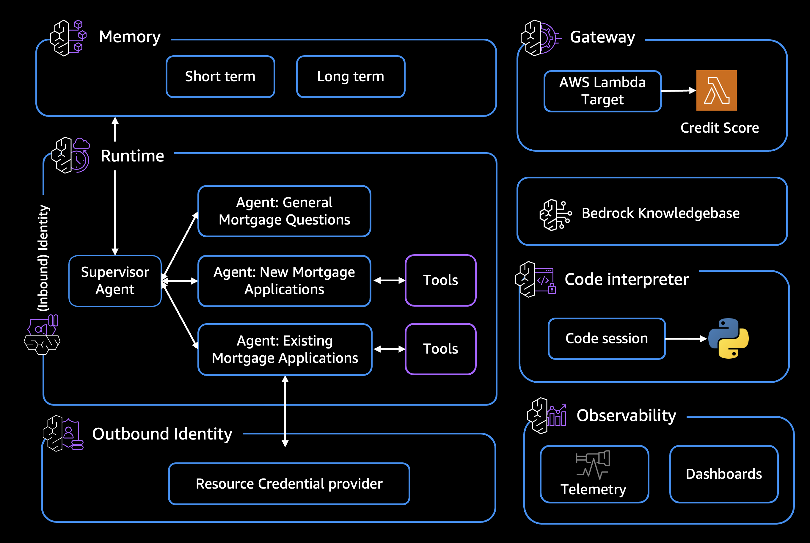

Welcome to the comprehensive workshop on [Amazon Bedrock AgentCore](https://aws.amazon.com/bedrock/agentcore/), a fully managed service that enables you to deploy and operate highly capable AI agents securely at scale. AgentCore provides purpose-built infrastructure for dynamic agent workloads, powerful tools to enhance agent capabilities, and essential enterprise controls for production deployment.

## What We're Building
In this hands-on workshop, you'll build a **Mortgage Assistant  Agent**  that demonstrates the full spectrum of AgentCore capabilities - from basic conversational AI to enterprise-grade deployment with memory, security, and observability.

By the end of this workshop, you will be able to:
* Deploy secure, scalable AI agents using AgentCore Runtime
* Implement robust authentication and authorization with AgentCore Identity
* Integrate external services through AgentCore Gateway
* Extend agent capabilities using AgentCore Tools
* Manage agent memory and context with AgentCore Memory
* Monitor agent performance with AgentCore Observability

## Workshop Structure
The workshop is divided into labs, where each one builds upon the previous labs to demonstrate the modules of AgentCore. 

1- Knowledgebase - Create an [Amazon Bedrock Knowledgebase](https://aws.amazon.com/bedrock/knowledge-bases/). The knowledgebase will serve as a source of truth for the agent for mortgage Q&A.

2- Local prototype - Build a multi-agent mortgage assistant using the [Strands Agents SDK](https://aws.amazon.com/blogs/opensource/introducing-strands-agents-an-open-source-ai-agents-sdk/). The prototype will be run locally for testing and demonstrates multi-agent orchestration.

3- AgentCore Runtime - Take your local mortgage assistant prototype and deploy it to [Amazon Bedrock AgentCore Runtime](https://aws.amazon.com/bedrock/agentcore/) - a secure, serverless, and purpose-built hosting environment for production AI agents.

4- AgentCore Gateway - Extend your mortgage assistant with external service capabilities using [Amazon Bedrock AgentCore Gateway](https://aws.amazon.com/blogs/machine-learning/introducing-amazon-bedrock-agentcore-gateway-transforming-enterprise-ai-agent-tool-development/). You'll implement a credit check functionality.

5- AgentCore Identity - Secure your mortgage assistant with robust authentication and authorization using [Amazon Bedrock AgentCore Identity](https://docs.aws.amazon.com/bedrock-agentcore/latest/devguide/identity.html). Implement workload identities for agent-to-service authentication and OAuth 2.0 flows for user authentication.

6- AgentCore Memory - Evovle the agent to a context-aware and personalized assistant by adding [Amazon Bedrock AgentCore Memory](https://docs.aws.amazon.com/bedrock-agentcore/latest/devguide/memory.html). Adding both short-term and long-term memory resources that agent can access.

7- AgentCore Observability - Review how to get real-time visibility into agent's operational performance using [Amazon Bedrock AgentCore Observability](https://docs.aws.amazon.com/bedrock-agentcore/latest/devguide/observability.html).

8- AgentCore Tools - Supercharge your mortgage assistant with [Amazon Bedrock AgentCore's built-in tools](https://docs.aws.amazon.com/bedrock-agentcore/latest/devguide/built-in-tools.html). Use the Code Interpreter tool to enable complex mortgage calculations.

&nbsp;

## Architecture:

